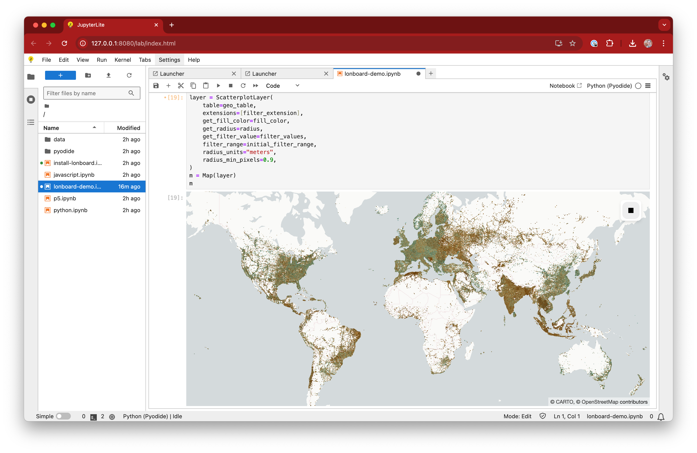

# JupyterLite + Lonboard Demo

JupyterLite deployed as a static site to GitHub Pages, for demo purposes.

## ✨ Try it in your browser ✨

➡️ **https://jupyterlite.ds.io/lab/index.html?path=lonboard%2Fdata-filter-extension.ipynb**

- [Satellite Location](https://jupyterlite.ds.io/lab/index.html?path=lonboard_example%2Fsatellite-location.ipynb)

## Requirements

JupyterLite is being tested against modern web browsers:

- Firefox 90+
- Chromium 89+

## Deploy your JupyterLite website on GitHub Pages

Check out the guide on the JupyterLite documentation: https://jupyterlite.readthedocs.io/en/latest/quickstart/deploy.html

## Further Information and Updates

For more info, keep an eye on the JupyterLite documentation:

- How-to Guides: https://jupyterlite.readthedocs.io/en/latest/howto/index.html
- Reference: https://jupyterlite.readthedocs.io/en/latest/reference/index.html
